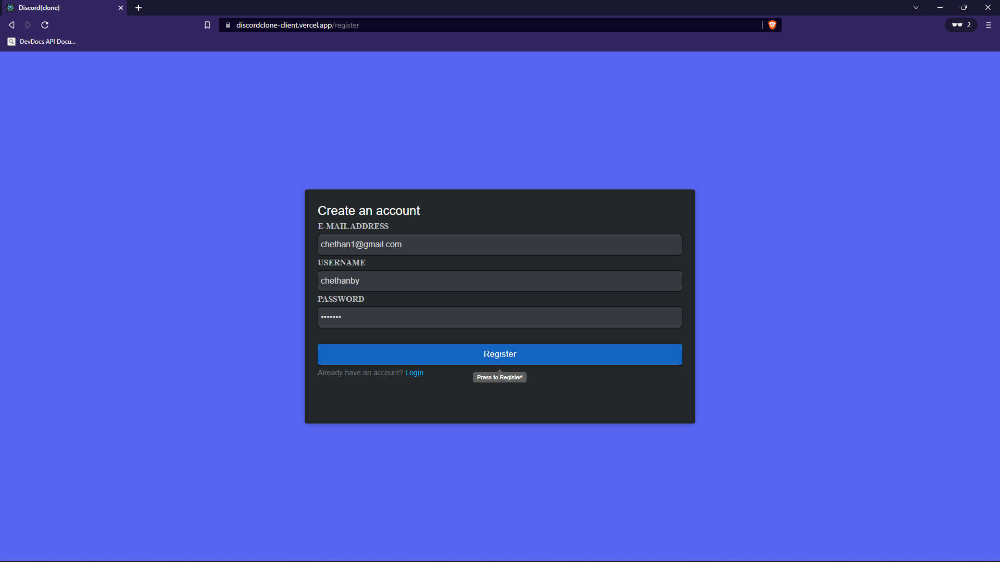
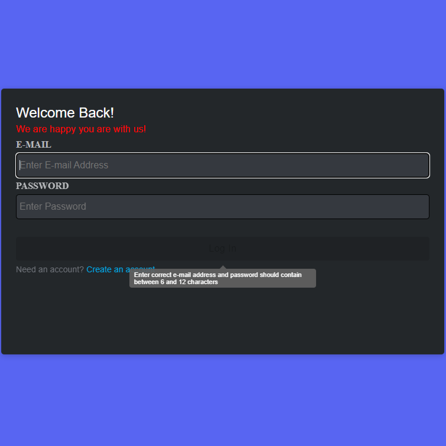
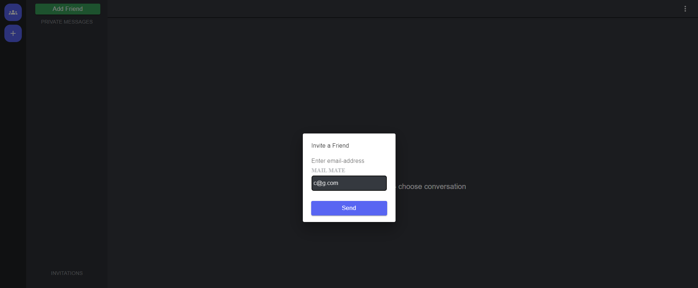
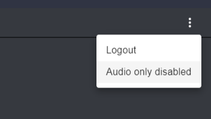
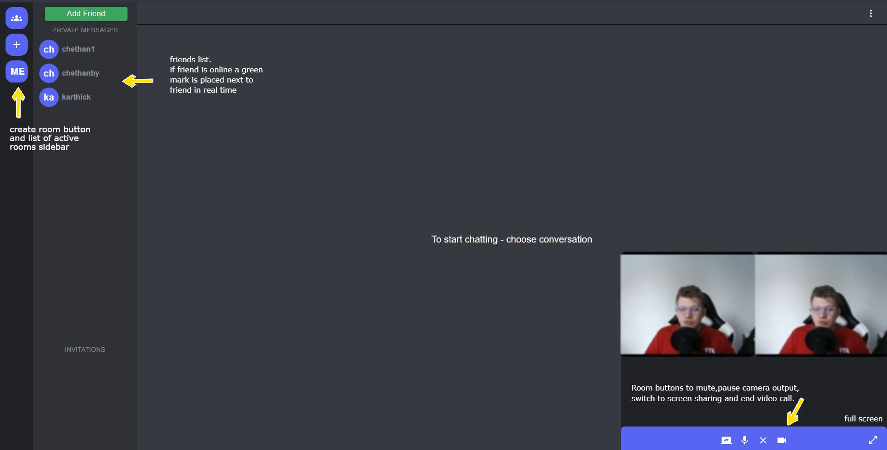
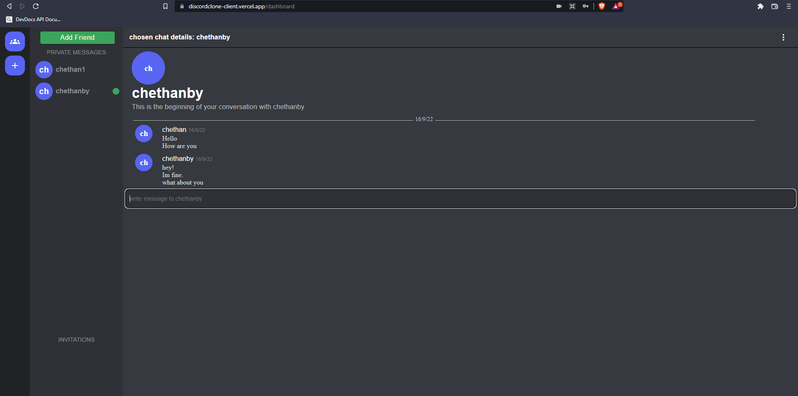

# Project Title
VideoChat Application [Discord Clone] 

## Demo

Live demo - https://discordclone-client.vercel.app .

## Tech Stack

**Client:** React, Redux, MaterialUI, Styled Components

**Server:** Node, Express, SocketIO, WebRTC, MonogDB, JWT Authentication

## Screenshots

Register Page

Login Page

Send Friend Invitation Via email-address

Hamburger Menu

Video Call 2 People

Messaging Real-Time

## Environment Variables

To run this project, you will need to add the following environment variables to your .env file
in server folder.

`MONGO` :MongoDB uri

`TOKEN_KEY` : JWT secret key

## Features

- Login / Registration (Authentication with JWT Token).If JWT Token Expires or is not availabe user is redirected to login page.
- users have the functionality to send friend invite to other users by entering their email id
- users have the ability to accept and reject friend Invites and data Updates in Real-time.
- Realtime chat functionality (SocketIO and MongoDB).Users have ability to send messages to friends in realtime
- Creating Video Group Call Rooms (WebRTC thanks to simple-peer). Upto 4 people simultaneously
- Built complete Backend with Endpoints to retrieve online users, online friends,active rooms.
- Login and Registration Form with complete form validation
- All users connected to server will be stored in server to show online users for realtime updates using socketIO
- Online/Offline friends data updates in real-time
- users can create/join rooms to stream video and audio or only audio of no webcam thanks to webRTC
- users can also stream their screen and has functionality to change between webcam video or screen sharing
- users can mute themself while streaming.
- All the above actions can be performed only if Authenticated via JWT Token based Authentication.

